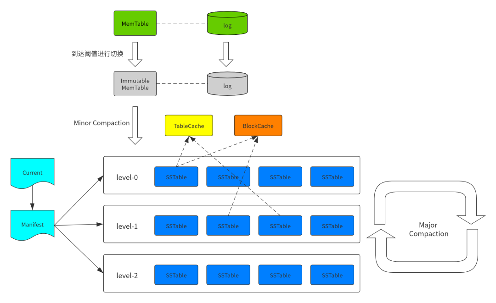

# LevelDB_Rust

#### 介绍
LevelDB for rust.
LevelDB是一款写性能十分优秀的可持久化的KV存储引擎，其实现原理是依据LSM-Tree（Log Structed-Merge Tree）.

#### 软件架构

LevelDB是一款写性能十分优秀的可持久化的KV存储引擎，其实现原理是依据LSM-Tree（Log Structed-Merge Tree）.

LSM tree (log-structured merge-tree) 是一种对写操作非常友好的存储方案。

LSM tree 是许多 KV型或日志型数据库所依赖的核心实现，例如BigTable、HBase、Cassandra、LevelDB、SQLite、RocksDB 等

#### 安装教程

1.  xxxx

#### 使用说明

1.  xxxx

#### 参与贡献

1.  Fork 本仓库
2.  新建 feat/1.0.0_util_xxx 分支
3.  提交代码
4.  新建 Pull Request

## TODO
[TODO和分工](doc/TODOList.md)

## 编码和git规范
[编码和git规范](doc/CodeStyle.md)

## RoadMap
1. 1.0.0 版本, 完成 util 相关的内容

| 功能模块                          | 完成人             | 进度   |
|-------------------------------|-----------------|------|
| Arena (Memory Management)     | wangboo         | 100% |
| bloom                         | fengyang        | 10%  |
| Cache                         | colagy          |      |
| Coding (Primitive Type SerDe) | colagy          |      |
| Comparator                    | fengyang        | 90%  |
| CRC                           | wangboo、lxd5866 | 100% |
| Env                           | lxd5866         |      |
| filter_policy                 | fengyang        | 10%  |
| Hash                          | fengyang        | 100% |
| Histgram                      | kazeseiriou     | 100% |
| loging                        |                 |      |
| MutexLock                     | kazeseiriou     | 100% |
| Random                        | colagy          |      |
| Status                        | fengyang        | 100% |
| Slice                         | wangboo         | 100% |

2. 1.1.0 版本, 完成基础零部件

| 功能模块             | 完成人     | 进度  |
|------------------|---------|-----|
| skiplist         | 未认领     |     |
| MemTableIterator | 未认领     |     |
| MemTable         | 未认领     |     |
| LogReader        | wangboo | 90% |
| LogWriter        | wangboo | 90% |
| TableCache       | 未认领     |     |
| FileMetaData     | 未认领     |     |
| VersionEdit      | 未认领     |     |
| VersionSet       | 未认领     |     |
| ReadOptions      | 未认领     |     |
| WriteOptions     | 未认领     |     |
| WriteBatch       | 未认领     |     |

3. 1.2.0 版本, 完成核心组件